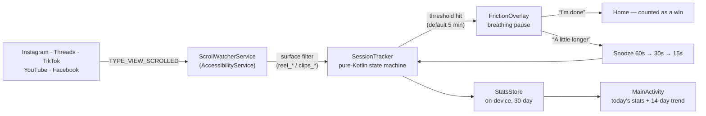

# Undertow

[](https://github.com/jacobv25/undertow/actions/workflows/ci.yml)
[](https://github.com/jacobv25/undertow/releases)
[](LICENSE)

<!-- TODO: demo GIF goes here — adb screenrecord of scroll → overlay → walk away -->

An Android anti-doomscrolling app: it watches for continuous scrolling in feed
apps and throws up a full-screen "take a breath" pause when a session runs long.
Friction, not a hard block — research on habit interventions says interrupts you
can dismiss get kept, hard blocks get uninstalled.

## How it works



- **`ScrollWatcherService`** — an `AccessibilityService` receiving
  `TYPE_VIEW_SCROLLED` events system-wide, filtered to the watched apps
  (Instagram, Threads, Facebook, TikTok, YouTube). For YouTube, only scrolling inside the
  Shorts surface counts (detected via `reel*` view resource ids), so normal
  videos and subscriptions are free.
- **`SessionTracker`** — pure-Kotlin state machine (unit-tested). A "doom
  session" accumulates while scroll events keep arriving in one app; a 60s gap
  or an app switch resets it. At the threshold (default 5 min) it fires an
  interrupt. Snoozes shrink each time: 60s → 30s → 15s.
- **`FrictionOverlay`** — full-screen pause drawn with
  `TYPE_ACCESSIBILITY_OVERLAY` (no extra permission): breathing circle, session
  length, and two exits — *"I'm done — take me out"* (goes Home, counts as a
  win) or *"A little longer"* (snooze).
- **`StatsStore`** — per-day per-app counters (minutes scrolled, interrupts,
  times you walked away) in SharedPreferences, 30-day retention, local only.
- **`MainActivity`** — Compose UI: permission onboarding, threshold slider,
  per-app toggles, today's stats, and a 14-day trend chart.

### v0.2.0

- **14-day trend chart** on the home screen (bars = minutes doomscrolled per
  day, today highlighted).
- **"Reels only" toggle for Instagram** — count only the Reels surface
  (`clips_*` view ids), leaving the regular feed free, same mechanism as
  YouTube Shorts detection.
- **Strict mode** — the snooze button requires a deliberate 3-second hold
  (with countdown) instead of a reflex tap.

Nothing scrolled past is read or stored; only scroll *events* and the app they
happened in are counted, entirely on-device.

## Build / test / install

```sh
JAVA_HOME=/opt/homebrew/opt/openjdk@17 ./gradlew assembleDebug testDebugUnitTest
adb install app/build/outputs/apk/debug/app-debug.apk
```

Release builds are signed when a `keystore.properties` (gitignored; see
`app/build.gradle.kts`) points at a local keystore — otherwise
`assembleRelease` produces an unsigned APK. Signed APKs for each version are
on the [Releases page](https://github.com/jacobv25/undertow/releases).

Then open Undertow → "Open accessibility settings" → enable **Undertow scroll
watcher**. (Sideloaded apps may need "Allow restricted settings" under
App info ⋮ menu on Android 13+ before the toggle unlocks.)

## Known limitations / ideas

- Facebook counts *all* scrolling (its Reels surface ids are less stable /
  documented than Instagram's `clips_*`).
- TikTok is registered under both `com.zhiliaoapp.musically` and
  `com.ss.android.ugc.trill` (regional builds).
- Surface detection depends on the target apps' view resource ids
  (`reel_*`, `clips_*`) — an app update that renames them would need the
  needle re-derived (`adb shell uiautomator dump` while on the surface).
